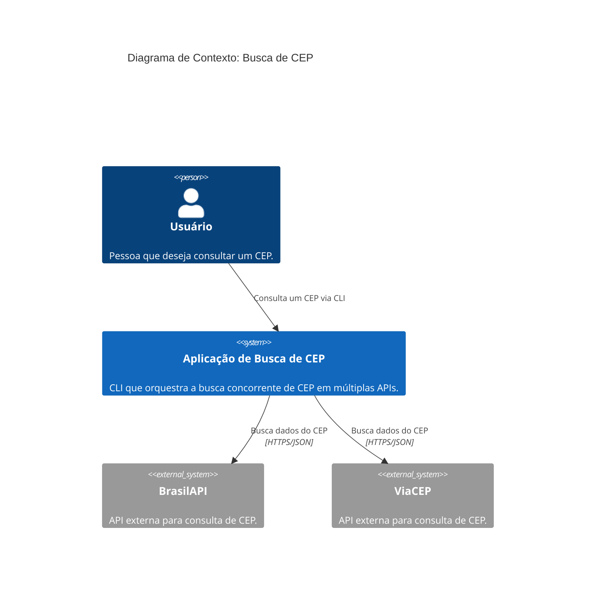
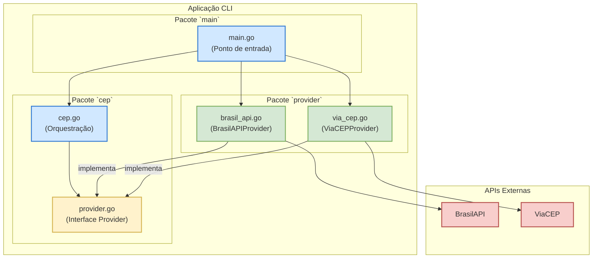

# Desafio Go Expert - Multithreading

Este projeto é uma solução para o desafio de multithreading do curso Go Expert. O objetivo é criar uma aplicação que consulta duas APIs de CEP diferentes simultaneamente e retorna a resposta daquela que for mais rápida, com um timeout global de 1 segundo.

O código foi refatorado para seguir os princípios SOLID, utilizando uma arquitetura de provedores para desacoplar a lógica de negócio das implementações concretas de busca de CEP.

## Funcionalidades

- **Arquitetura Extensível (SOLID)**: Utiliza uma interface `Provider` para permitir a fácil adição de novas fontes de CEP sem alterar a lógica principal.
- **Busca Concorrente**: Utiliza goroutines para consultar múltiplos provedores (atualmente [BrasilAPI](https://brasilapi.com.br/) e [ViaCEP](http://viacep.com.br/)) ao mesmo tempo.
- **Timeout Global**: Implementa um `context.WithTimeout` para garantir que a aplicação não espere mais de 1 segundo por uma resposta.
- **Validação de CEP**: O CEP fornecido como entrada é validado para garantir que contém exatamente 8 dígitos numéricos.
- **Testes com Mocks**: Cobertura de testes de 100% para a lógica de negócio, utilizando um `MockProvider` para simular as respostas das APIs de forma rápida e confiável.
- **Erros Centralizados**: Erros padrão da aplicação são definidos como constantes para consistência e manutenibilidade.

## Tecnologias e Conceitos Utilizados

- **Go (Golang)**
- **Princípios SOLID**: Foco em Inversão de Dependência e Responsabilidade Única.
- **Interfaces** para abstração da lógica de busca.
- **Goroutines** para concorrência.
- **Channels** para comunicação entre goroutines.
- **`context`** para controle de timeout e cancelamento.
- **`sync.WaitGroup`** para sincronização.
- **`testify/assert`** para asserções nos testes.
- **Módulos Go** para gerenciamento de dependências.

## Arquitetura (C4 Model)

A arquitetura foi modelada usando C4 para ilustrar as decisões de design.

### Nível 1: Diagrama de Contexto do Sistema

Este diagrama mostra a interação do sistema com seus usuários e com as APIs externas de CEP.



### Nível 3: Diagrama de Componentes

Este diagrama detalha os principais componentes (pacotes e structs) dentro da aplicação, mostrando como a lógica foi desacoplada através da interface `Provider`.



## Como Executar

### Pré-requisitos

- Go 1.18 ou superior.

### Execução

1.  Clone o repositório:
    ```sh
    git clone https://github.com/markuscandido/go-expert-desafio-multithreading.git
    cd go-expert-desafio-multithreading
    ```

2.  Execute a aplicação passando um CEP como argumento:
    ```sh
    go run main.go 01001000
    ```

    Você pode usar um CEP com ou sem formatação:
    ```sh
    go run main.go 01001-000
    ```

### Executando os Testes

Para rodar a suíte de testes e ver a cobertura, execute o comando:

```sh
go test ./... -cover
```
